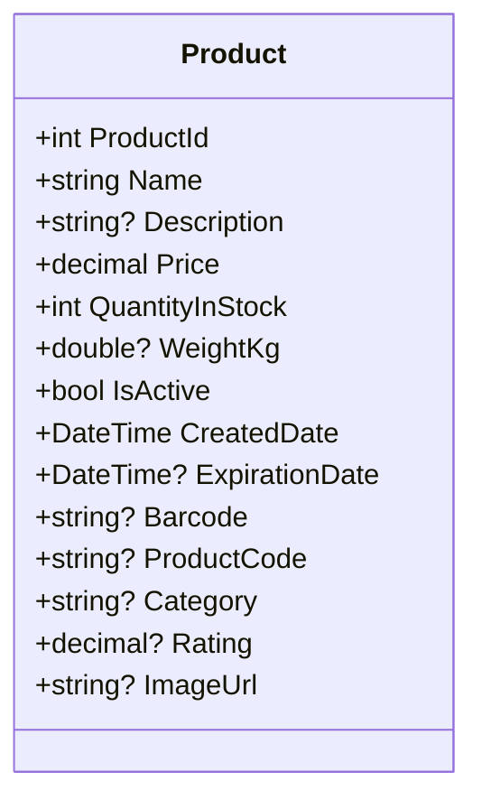

# Tesztadatok – Products tábla

Az alkalmazás **InMemory EF Core adatbázist** használ, amely induláskor feltöltődik 30 darab magyar nyelvű Product adattal.  
# Feladatok – Count műveletek REST API-val

Az alábbi feladatok célja, hogy a diákok gyakorolják a **számolásos (COUNT)** lekérdezéseket a `Products` táblán, és a lekérdezéseket REST API végpontokon keresztül érjék el.  
A feladatok nehézsége fokozatosan nő: az egyszerű összeszámolástól a feltételes és összetettebb számolásokig.

## 1. feladat – Termékek összeszámlálása
Számold meg, hány termék található az adatbázisban összesen!

**Végpont:**  GET /api/products/count

## 2. feladat – Aktív termékek száma
Számold meg, hány aktív (`IsActive = true`) termék található!

**Végpont:**  GET /api/products/count/active

## 3. feladat – Kategóriánkénti darabszám
Számold meg, hány termék tartozik egy adott kategóriába (pl. `Pékáru`)!

**Végpont (példa Pékáru kategóriára):**  GET /api/products/count/category/Pékáru

## 4. feladat – Lejárt termékek száma
Számold meg, hány terméknek van **lejárati dátuma** (`ExpirationDate`), amely **már korábban lejárt** a mai naphoz képest.

**Végpont:** GET /api/products/count/expired

## 5. feladat – Meghatározott ár alatti termékek száma
Számold meg, hány termék árának értéke kisebb egy megadott határértéknél (pl. 1000 Ft)!

**Végpont (példa 1000 Ft-ra):**  GET /api/products/count/price/less/1000

## 6. feladat – Meghatározott értékelés fölötti termékek száma
Számold meg, hány termék értékelése (`Rating`) nagyobb egy adott értéknél (pl. 4.5)!

**Végpont (példa 4.5-re):**  GET /api/products/count/rating/greater/4.5

## Product mezők

| Mező neve       | Típus       | Leírás |
|-----------------|-------------|--------|
| ProductId       | int         | Egyedi azonosító |
| Name            | string      | Termék neve |
| Description     | string?     | Termék rövid leírása |
| Price           | decimal     | Ár (pl. 999.00) |
| QuantityInStock | int         | Készleten lévő mennyiség |
| WeightKg        | double?     | Súly kilogrammban |
| IsActive        | bool        | Aktív-e a termék |
| CreatedDate     | DateTime    | Mikor lett létrehozva |
| ExpirationDate  | DateTime?   | Lejárati dátum (ha van) |
| Barcode         | string?     | Vonalkód |
| ProductCode     | string?     | Belső azonosító |
| Category        | string?     | Kategória (pl. "Pékáru") |
| Rating          | decimal?    | Vásárlói értékelés (0.0–5.0) |
| ImageUrl        | string?     | Termék képének linkje |
## Példák a tesztadatokra

Az adatbázis induláskor feltöltődik 30 db magyar termékkel. Az alábbi táblázatban az első 6 termék minden fontos mezője látható:

| ProductId | Name                  | Description         | Price | QuantityInStock | WeightKg | IsActive | CreatedDate | ExpirationDate | Barcode       | ProductCode   | Category       | Rating | ImageUrl |
|-----------|-----------------------|---------------------|-------|-----------------|----------|----------|-------------|----------------|---------------|---------------|----------------|--------|----------|
| 1         | Fehér kenyér 1 kg     | Friss pékáru        | 499   | 120             | 1.0      | true     | 2025-01-01  | 2025-01-04     | 5991234567890 | PA-001        | Pékáru         | 4.3    | –        |
| 2         | Teljes kiőrlésű zsömle| Magvas              | 129   | 300             | 0.08     | true     | 2025-01-01  | 2025-01-03     | 5991234567891 | PA-002        | Pékáru         | 4.6    | –        |
| 3         | Tej 1,5% 1 l          | Félzsíros tej, ESL  | 359   | 200             | 1.02     | true     | 2025-01-01  | 2025-01-11     | 5991234567892 | TEJ-015       | Tejtermék      | 4.5    | –        |
| 4         | Trappista sajt 250 g  | Szeletelt           | 1099  | 90              | 0.25     | true     | 2025-01-01  | 2025-01-21     | 5991234567893 | SAJT-TR-250   | Tejtermék      | 4.2    | –        |
| 5         | Vaj 200 g             | 82% zsírtartalom    | 1199  | 60              | 0.2      | true     | 2025-01-01  | 2025-01-31     | 5991234567894 | VAJ-200       | Tejtermék      | 4.7    | –        |
| 6         | Tojás M 10 db         | Friss, magyar       | 899   | 150             | 0.6      | true     | 2025-01-01  | 2025-01-15     | 5991234567895 | TOJ-M-10      | Alapélelmiszer | 4.8    | –        |

👉 A teljes lista a kódban található: [`ModelBuilderExtensions.cs`](Context/ModelBuilderExtension.cs).
