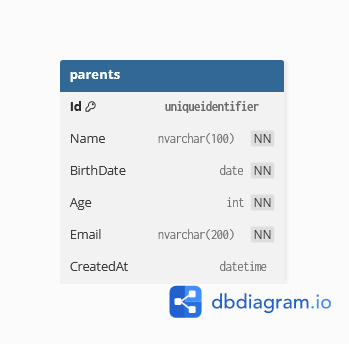
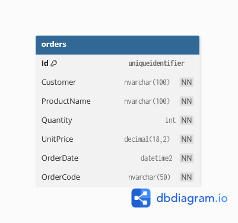
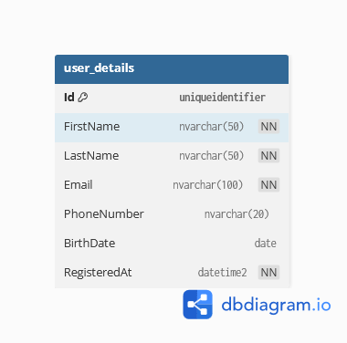

# 1. feladat

## Paranet feladat leírás

Készítsd el a **Parent** táblát az alábbi specifikáció alapján.

---

### Egyed neve: `Parent`

**Leírás:** A szülők adatait tartalmazza (név, életkor, születési dátum, e-mail cím).

| Mező neve | Típus | Megszorítások | Leírás |
| --- | --- | --- | --- |
| Id  | uniqueidentifier (GUID) | PK  | Egyedi azonosító |
| Name | nvarchar(100) | NOT NULL | Szülő neve |
| BirthDate | date | NOT NULL | Születési dátum |
| Age | int | CHECK (Age >= 0) | Életkor, nem lehet negatív |
| Email | nvarchar(200) | UNIQUE, NOT NULL | E-mail cím, nem lehet ismétlődés |
| CreatedAt | datetime2 | DEFAULT (getutcdate()) | Rögzítés dátuma |

---

### Teendőid

1. Parent osztály létrehozása a model rétegben. Helye: `Models/Parent.cs`!
2. (Haladó) Készítsd el a C# modellt és a Fluent API konfigurációt, hogy megfeleljen a diagramnak !
3. Készíts **seed** adatokat egy bővítőosztályban: `Data/ModelBuilderExtensions.cs` → pl. 3–5 minta `Parent`!
4. Készíts egy **REST végpontot**, amely visszaadja az összes szülőt: **GET** `/api/parents` → HTTP 200 + JSON tömb!
5. Ellenőrizd, hogy az **Email** egyediség megsértése hibát eredményez-e!.

### ER diagram

# 2. feladat

## Order feladat leírás

Készítsd el az **Order** táblát az alábbi specifikáció alapján.

---

### Egyed neve: `Order`

**Leírás:** A megrendeléseket tartalmazza (azonosító, vevő neve, termék neve, mennyiség, egységár, dátum).

| Mező neve | Típus | Megszorítások | Leírás |
| --- | --- | --- | --- |
| Id  | uniqueidentifier (GUID) | PK  | Egyedi azonosító |
| Customer | nvarchar(100) | NOT NULL | A megrendelő neve |
| ProductName | nvarchar(100) | NOT NULL | A megrendelt termék neve |
| Quantity | int | CHECK (Quantity > 0) | Rendelési mennyiség |
| UnitPrice | decimal(18,2) | CHECK (UnitPrice >= 0) | Egységár forintban |
| OrderDate | datetime2 | DEFAULT (getutcdate()) | Rendelés rögzítésének dátuma |
| OrderCode | nvarchar(50) | UNIQUE, NOT NULL | Rendelés kódja (pl. OR-2025-01) |

---

### Teendőid

1. Hozd létre az `Order` osztályt a **model** rétegben (`Models/Order.cs`).
2. (Haladó) Készítsd el a C# modellt és a **Fluent API konfigurációt**, hogy megfeleljen a fenti diagramnak.
3. Készíts **seed** adatokat egy bővítőosztályban: `Data/ModelBuilderExtensions.cs` → pl. 3–5 minta `Order`.
4. Készíts egy **REST végpontot**, amely visszaadja az összes rendelést: **GET** `/api/orders` → HTTP 200 + JSON tömb.
5. Ellenőrizd, hogy az **OrderCode** egyediség megsértése hibát eredményez-e, és hogy a `Quantity` és `UnitPrice` megszorítások érvényesülnek.

### ER diagram

# 3. feladat

Készíts táblát a felhasználó egyedi adatairól is!

🧾 Egyed neve: `UserDetails`

**Leírás:**  
A felhasználók részletes adatait tárolja, beleértve a nevüket, e-mail címüket, telefonszámukat és regisztrációs dátumukat.

| Mező neve | Típus | Megszorítások | Leírás |
| --- | --- | --- | --- |
| Id  | uniqueidentifier (GUID) | PK  | Egyedi azonosító |
| FirstName | nvarchar(50) | NOT NULL | Felhasználó keresztneve |
| LastName | nvarchar(50) | NOT NULL | Felhasználó vezetékneve |
| Email | nvarchar(100) | UNIQUE, NOT NULL | Egyedi e-mail cím |
| PhoneNumber | nvarchar(20) | *(opcionális)* | Telefonszám (nem kötelező) |
| BirthDate | date | *(opcionális)* | Születési dátum |
| RegisteredAt | datetime2 | DEFAULT (getutcdate()), NOT NULL |     |

